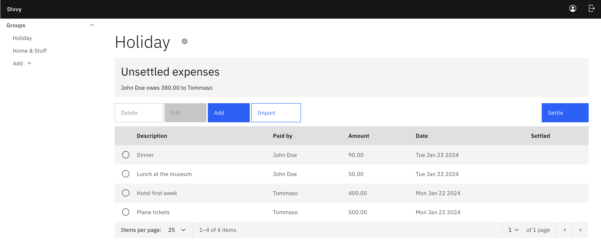

# DivvyUp

DivvyUp is a Splitwise replacement you can self-host. It's a web app built with
[Pocketbase](https://pocketbase.io/) and [SvelteKit](https://kit.svelte.dev/).



## Features

### Groups

In DivvyUp you can create groups and invite people to them using their user ID.
You can also delete groups.

Group members are expected to share expenses equally.

### Expenses

#### Importing expenses from a CSV or Excel file

You can add expenses in a group using a form, but you can also import expenses
from a CSV or Excel file.
This is useful if you want to import expenses from your bank account for example.

The import preview will guide you through the process of mapping the columns in the
file to the fields in the expense.

Finally, the import preview allows you to review the expenses before they are
added to the group.

https://github.com/TommasoAmici/divvy-up/assets/424525/86a13fd5-c754-4c88-b90b-c63606122f69

## Deployment

### Build frontend

First, you'll want to build the frontend application.

The frontend build will place the static files in `pb_public`. The contents
of this directory are served by Pocketbase.

```sh
bun install
bun run build
```

### Deploy Pocketbase

The following steps mirror the official [documentation](https://pocketbase.io/docs/going-to-production/).

#### Sync files to your server

```sh
rsync -azvr --delete pb_migrations/ user@server:/path/to/pb_migrations/
rsync -azvr --delete pb_public/ user@server:/path/to/pb_public/
```

#### Install Pocketbase on your server

```sh
wget https://github.com/pocketbase/pocketbase/releases/download/v0.20.7/pocketbase_0.20.7_linux_amd64.zip
unzip pocketbase_0.20.7_linux_amd64.zip
# run with
./pocketbase serve [--http 127.0.0.1:$PORT]
```
